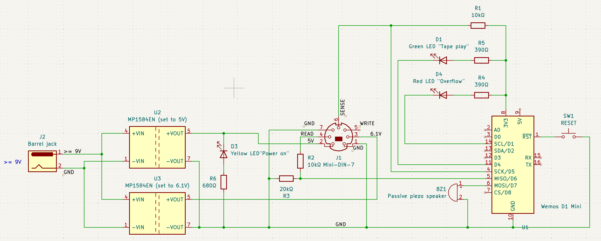

# Tapeosaurus


Cycle-accurate tape dumper for the **Commodore 16 / Plus/4**, **Commodore 64 / 128**, and **ZX Spectrum**, running on a single Wemos D1 Mini (ESP8266) with a 3D-printable enclosure.

Inspired by Francesco Vannini's [TrueTape64](https://github.com/francescovannini/truetape64).

Supports C16/Plus4 standard tape and Novaload turbo, Commodore 64/128 tapes, and ZX Spectrum standard ROM tapes — producing standard `.tap` v2 / `.tzx` files compatible with VICE, Fuse, Tapuino, TZXDuino, and any other TAP/TZX-capable emulator or hardware.

---

## Hardware

### What you need

| Qty | Part                                       | Note                                             |
| --- | ------------------------------------------ | ------------------------------------------------ |
| 1   | Wemos D1 Mini                              | Any revision; clones work fine                   |
| 1   | MP1584EN step-down module                  | Adjustable buck converter — set output to 5.00 V |
| 1   | MP1584EN step-down module                  | Adjustable buck converter — set output to 6.10 V |
| 1   | 10 kΩ resistor                             | READ voltage divider - in series with READ pin   |
| 1   | 20 kΩ resistor                             | READ voltage divider - shunt to GND              |
| 1   | 10 kΩ resistor                             | SENSE pull-up to 3.3 V                           |
| 1   | Green LED                                  | "Tape play" indicator                            |
| 1   | Red LED                                    | "Overflow" indicator                             |
| 1   | Yellow LED                                 | "Power on" indicator                             |
| 2   | 390 Ω resistors                            | Green and red LED current limiters               |
| 1   | 680 Ω resistor                             | Yellow LED current limiters                      |
| 1   | Passive piezo speaker                      | Tape audio feedback                              |
| 1   | 7-pin mini-DIN connector or salvaged cable | Commodore 16 Datasette connector                 |
| 1   | Mini tactile switch                        | Reset button                                     |
| 1   | DC jack barrel connector with PCB mount    | Power supply connector                           |
| 1   | >= 9V DC power supply                      | Powers both MP1584EN modules                     |

### ZX Spectrum hardware notes

#### Using a Commodore tape player

Spectrum tapes can be dumped using a Commodore datasette, no firmware changes required.

#### Using a standard tape player

The Spectrum EAR socket outputs a 5 V audio signal (not TTL).  The same
**10 kΩ / 20 kΩ voltage divider** used for the Commodore READ line is suitable
here — connect the EAR tip to the divider input and the sleeve to GND.

The Spectrum has no motor-control line equivalent to SENSE; the capture starts
as soon as the CLI detects the first pulse.  Because `CAPTURE_WITHOUT_SENSE`
defaults to `0`, the firmware waits for the SENSE pin to go LOW before it
starts storing pulses.  For Spectrum use, either:

- wire a simple switch to the SENSE pin (pull it LOW when you press PLAY), **or**
- recompile the firmware with `#define CAPTURE_WITHOUT_SENSE 1` (the CLI will
  still wait for the first `CMD_PLAY_PRESSED` event, which in this mode fires
  on the first pulse rather than on the SENSE signal).

### Pin mapping

| Wemos Pin | GPIO   | Function                                              |
| --------- | ------ | ----------------------------------------------------- |
| D1        | GPIO5  | Overflow LED (lit if data overflow triggered)         |
| D4        | GPIO2  | Onboard LED (active LOW - lit while recording)        |
| D5        | GPIO14 | SENSE from Datasette (INPUT\_PULLUP, switch to GND)   |
| D6        | GPIO12 | READ from Datasette (via 10 kΩ/20 kΩ divider → 3.3 V) |
| D7        | GPIO13 | Passive piezo speaker                                 |

### Schematics



> ⚠ The ESP8266 is a 3.3 V device. The Datasette/EAR READ line is 5 V. The 10 kΩ / 20 kΩ divider is **mandatory** — skipping it will damage GPIO12.

### 3D-printable enclosure

Autodesk Fusion 360 files are provided [here](CAD).

### MP1584EN Step-Down Calibration

Each module must be pre-adjusted before connecting the Datasette.

**Module U2 — 5 V (Datasette logic supply)** Connect 12 V, measure OUT+ and adjust the trimpot to 5.00 V.

**Module U3 — 6.1 V (Datasette motor)** Connect 12 V, measure OUT+ and adjust the trimpot to 6.10–6.15 V. Recheck with the motor spinning under load. Values above 6.5 V risk burning the motor winding.

### Quick Sanity Checks Before First Use

- [ ] MP1584EN-U2 output reads 5.00 V (Datasette logic supply)
- [ ] MP1584EN-U3 output reads 6.10–6.15 V on MOTOR line (Datasette disconnected)
- [ ] Multimeter reads ~3.3 V on Wemos 3V3 pin
- [ ] SENSE pin reads ~3.3 V at idle (no tape playing)
- [ ] SENSE pin reads ~0 V when PLAY is pressed (with cassette inserted)
- [ ] No short between 5V and GND (continuity check — no beep)
- [ ] READ pin reads ~3.3 V with tape playing (signal swings around this level)

---

## Firmware

### Requirements

- Arduino IDE 1.8+ or 2.x
- ESP8266 Arduino core — add this URL in **File → Preferences → Additional Boards Manager URLs**:
`https://arduino.esp8266.com/stable/package_esp8266com_index.json`

### Board settings

| Setting       | Value                            |
| ------------- | -------------------------------- |
| Board         | LOLIN(WEMOS) D1 R2 & mini        |
| CPU Frequency | **80 MHz** ← must be 80, not 160 |
| Upload Speed  | 921600                           |

> The `CLOCK_SCALE 40` constant (80 MHz ÷ 40 = 2 MHz ticks) is hardcoded. Changing CPU frequency without updating this value will corrupt all timing.

### Tuning options

| Define                  | Default | Description                                                                              |
| ----------------------- | ------- | ---------------------------------------------------------------------------------------- |
| `CAPTURE_WITHOUT_SENSE` | `0`     | Set to `1` to capture without waiting for PLAY — useful for Spectrum or READ wiring tests |

> Edge mode (FALLING/CHANGE) is not a compile-time setting. It is controlled entirely at runtime by the Python CLI over the serial control protocol. The default on power-up is FALLING (standard KERNAL) — safe until the CLI sets it otherwise.  For `-model spectrum` the CLI automatically sends `HOST_CMD_CHANGE` before capture.

---

## Python CLI

### Install

```
pip install -r cli/requirements.txt
```

### Usage

```
# Standard C16/Plus4 tape (PAL)
python3 cli/tapeosaurus.py -p /dev/ttyUSB0 -model c16 output.tap

# C16/Plus4 Novaload turbo
python3 cli/tapeosaurus.py -p /dev/ttyUSB0 -model c16 --novaload output.tap

# C16/Plus4 NTSC machine
python3 cli/tapeosaurus.py -p /dev/ttyUSB0 -model c16 --ntsc output.tap

# C16/Plus4 Extract PRG files after capture
python3 cli/tapeosaurus.py -p /dev/ttyUSB0 -model c16 --prg output.tap

# C64/128 tape (PAL)
python3 cli/tapeosaurus.py -p /dev/ttyUSB0 -model c64 output.tap

# ZX Spectrum tape → TZX (default, recommended)
python3 cli/tapeosaurus.py -p /dev/ttyUSB0 -model spectrum output.tzx

# ZX Spectrum tape → raw .tap
python3 cli/tapeosaurus.py -p /dev/ttyUSB0 -model spectrum --tap output.tap

# ZX Spectrum tape → TZX + extract .bin files
python3 cli/tapeosaurus.py -p /dev/ttyUSB0 -model spectrum --prg output.tzx
```

Passing `--novaload` is required for C16/Plus4 Novaload turbo tapes. The CLI automatically sends the correct edge mode command to the ESP before waiting for PLAY, then selects the appropriate decode path after capture. No switches, no recompile.

### What happens at startup

1. CLI connects and waits 2 seconds for the ESP to boot
2. Sends `CMD_SET_EDGE_FALLING` or `CMD_SET_EDGE_CHANGE` depending on model / flags
3. Waits up to 3 seconds for the ESP's confirmation echo
4. Prints the confirmed edge mode and waits for PLAY

```
ZX Spectrum — 3.5 MHz — output: .tzx
Capturing → output.tzx
→  Setting edge mode: CHANGE (Novaload/turbo)
✔  Edge mode confirmed by device: CHANGE (Novaload/turbo)
Waiting for PLAY (LED lights up)...
```

```
C16/Plus4 PAL — scale: 0.443362
Capturing → output.tap
→  Setting edge mode: FALLING (standard)
✔  Edge mode confirmed by device: FALLING (standard)
Waiting for PLAY (LED lights up)...
```

```
C64 PAL — scale: 0.492624
Capturing → output.tap
→  Setting edge mode: FALLING (standard)
✔  Edge mode confirmed by device: FALLING (standard)
Waiting for PLAY (LED lights up)...
```

### Real examples

#### Dumping a ZX Spectrum tape

```
$ python3 cli/tapeosaurus.py -p /dev/ttyUSB0 -model spectrum --prg "Manic Miner.tzx"
ZX Spectrum — 3.5 MHz — output: .tzx
Capturing → Manic Miner.tzx
→  Setting edge mode: CHANGE (Novaload/turbo)
✔  Edge mode confirmed by device: CHANGE (Novaload/turbo)
Waiting for PLAY (LED lights up)...
▶  RECORDING...
  … 420,000 pulses
✅ STOPPED — 421,044 pulses
🔍 Decoding ZX Spectrum ROM blocks...

  Block 0: Header  ✔
    Type    : Bytes
    Name    : "Manic Min"
    Length  : 49152 bytes
    Load    : $8000
  Block 1: Data    ✔  (49152 bytes payload)

✅ TZX written: Manic Miner.tzx (98,340 B)
  ✅ BIN: Manic_Min.bin (49152 B, load $8000)
💡 Spectrum TZX compatible with: Fuse, SpecEmu, ZXSpin, TZXDuino
💡 Full decode: tzxtools --info Manic Miner.tzx
```

#### Dumping a C16/Plus4 Novaload tape

```
$ python3 cli/tapeosaurus.py -p /dev/ttyUSB0 --novaload "./BMX Racers.tap"
C16/Plus4 Novaload PAL — scale: 0.443362
Capturing → ./BMX Racers.tap
→  Setting edge mode: CHANGE (Novaload/turbo)
✔  Edge mode confirmed by device: CHANGE (Novaload/turbo)
Waiting for PLAY (LED lights up)...
▶  RECORDING...
  … silence (2s)
✅ STOPPED — 313,211 pulses
✅ TAP written: ./BMX Racers.tap (313,244 B)
💡 Novaload turbo — use the raw TAP in YAPE/VICE or wav2prg
  Found: "8" ($0801–$0803, 3 B)
```

#### Dumping a C64/128 tape

```
$ python3 cli/tapeosaurus.py -p /dev/ttyUSB0 -model c64 "./Treasure Island.tap"
C64 PAL — scale: 0.492624
Capturing → ./Treasure Island.tap
→  Setting edge mode: FALLING (standard)
✔  Edge mode confirmed by device: FALLING (standard)
Waiting for PLAY (LED lights up)...
▶  RECORDING...
 … 460,000 pulses
✅ STOPPED — 461,633 pulses
✅ TAP written: ./Treasure Island.tap (461,860 B)
🔍 Decoding C64 KERNAL blocks...
  ⚠ No standard C64 KERNAL blocks found (sync not detected)
  Verify the tape is a standard (non-turbo) load, or try tapclean
💡 Full decode: wav2prg -P loaders --machine c64 --tap ./Treasure Island.tap
```

### Machine clock reference

| Machine                         | Clock      | Notes                       |
| ------------------------------- | ---------- | --------------------------- |
| Commodore 16 / Plus4 (standard) | 886 724 Hz PAL / 894 886 Hz NTSC | |
| Commodore 16 / Plus4 (Novaload) | 886 724 Hz PAL / 894 886 Hz NTSC | |
| Commodore 64 / 128              | 985 248 Hz PAL / 1 022 727 Hz NTSC | |
| ZX Spectrum (all models)        | 3 500 000 Hz | Fixed; --ntsc has no effect |

The firmware always outputs 2 MHz-equivalent ticks; the CLI scales them to the correct machine clock before writing the TAP/TZX file.

---

## ZX Spectrum — Technical Details

### Timing constants (3.5 MHz T-states)

| Signal            | T-states   |
| ----------------- | ---------- |
| Pilot half-pulse  | 2168       |
| Sync-1 half-pulse | 667        |
| Sync-2 half-pulse | 735        |
| Bit-0 half-pulse  | 855 × 2    |
| Bit-1 half-pulse  | 1710 × 2   |

### Block types

| Flag byte | Meaning                            |
| --------- | ---------------------------------- |
| 0x00      | Header block (19 bytes payload)    |
| 0xFF      | Data block (variable payload)      |

### Header block layout (flag = 0x00, 17 payload bytes)

| Offset | Size | Field    | Notes                                         |
| ------ | ---- | -------- | --------------------------------------------- |
| 0      | 1    | type     | 0=Program 1=NumArray 2=CharArray 3=Code/Bytes |
| 1      | 10   | filename | space-padded ASCII                            |
| 11     | 2    | length   | data block payload length                     |
| 13     | 2    | param1   | Program: LINE; Code: load address            |
| 15     | 2    | param2   | Program: BASIC length; Code: 0x8000          |

### Output formats

**TZX (default, `-model spectrum`)** — Standard Speed Data blocks (0x10) for
each decoded ROM block.  If no ROM blocks are decoded (e.g. custom/turbo
loader), a Direct Recording block (0x15) is written at 2 MHz sample rate so
the raw waveform is preserved.  Compatible with Fuse, SpecEmu, ZXSpin,
RealSpectrum, TZXDuino, and PZX2TZX tools.

**TAP (`--tap`)** — Raw `.tap` block stream, compatible with Fuse `--tape`,
ZX-Uno, and RetroVirtualMachine.  Only available when ROM blocks are
successfully decoded; custom loaders should use TZX.

---

## How it works

### Timing

1. A GPIO ISR fires on every pulse boundary (`FALLING` for standard, `CHANGE` for Novaload/Spectrum).
2. `ESP.getCycleCount()` is sampled inside the ISR — an 80 MHz hardware counter.
3. The delta between consecutive calls is divided by 40 to produce a 2 MHz tick unit.
4. Ticks are clamped to 24 bits and pushed into a 4096-entry ring buffer.
5. `loop()` drains the buffer to serial at 250 000 baud.

Wi-Fi is completely disabled at boot to eliminate scheduler jitter.

### Control protocol

All serial frames are exactly 4 bytes, in both directions.
The `[FF][FF][FF][CMD]` structure is used for host→device commands and `[00][00][00][CMD]` device→host events.

Device is Wemos D1 ESP, Host is the Linux host where `tapeosaurus.py` is run.

**Device → Host:**

| Frame            | Bytes                    | Meaning                                   |
| ---------------- | ------------------------ | ----------------------------------------- |
| Pulse data       | `[B0][B1][B2][B0^B1^B2]` | 24-bit tick count, 2 MHz clock, LSB first |
| PLAY pressed     | `[00][00][00][01]`       | Tape started — begin recording            |
| PLAY released    | `[00][00][00][02]`       | Tape stopped — end recording              |
| Overflow         | `[00][00][00][03]`       | Ring buffer full, data lost               |
| Edge mode change | `[00][00][00][04]`       | Confirmation: edge-mode changed           |

**Host → Device:**

| Frame       | Bytes              | Meaning                                  |
| ----------- | ------------------ | ---------------------------------------- |
| Set FALLING | `[FF][FF][FF][10]` | Switch to FALLING edge (standard KERNAL) |
| Set CHANGE  | `[FF][FF][FF][11]` | Switch to CHANGE edge (Novaload / Spectrum / turbo) |

---

## Troubleshooting

| Symptom                                 | Likely cause                   | Fix                                                                                                  |
| --------------------------------------- | ------------------------------ | ---------------------------------------------------------------------------------------------------- |
| `⚠ No echo from device` at startup     | ESP not ready or baud mismatch | Check baud is 250 000 in both CLI and Arduino IDE; power-cycle the Wemos                             |
| 0 pulses captured                       | READ wiring or wrong edge mode | Set `CAPTURE_WITHOUT_SENSE 1` to test READ independently; verify `--novaload` flag matches tape type |
| Novaload tape loads garbled             | Edge mode mismatch             | Ensure `--novaload` is passed for turbo tapes                                                        |
| Frame error: timeout before tape starts | Normal — motor spin-up gap     | CLI tolerates 30 s of silence before stopping                                                        |
| Motor doesn't spin / spins wrong speed  | MP1584EN-U3 not calibrated     | Set to 6.10–6.15 V with a multimeter before connecting                                               |
| Overflow LED lights up                  | Buffer draining too slowly     | Check baud is 250 000; close other apps using the port                                               |
| Garbled timing                          | CPU not at 80 MHz              | Check board settings in Arduino IDE                                                                  |
| Datasette not powering on               | MP1584EN-U2 not calibrated     | Verify 5 V output before connecting Datasette                                                        |
| Spectrum: no blocks decoded             | Custom/turbo loader            | TZX Direct Recording block is still written — use tzxtools or PlayTZX to play it back               |
| Spectrum: bad checksum warnings         | Worn tape or level mismatch    | Try adjusting the EAR volume on the source device; increase divider tolerance                        |
| Spectrum: SENSE never fires             | No SENSE wiring                | Compile with `CAPTURE_WITHOUT_SENSE 1` for Spectrum use                                              |

---

## Tested tapes

Here's a list of successfully [tested tapes](TAPES.md).

---

## Credits & license

Inspired by [TrueTape64](https://github.com/francescovannini/truetape64) by Francesco Vannini.

**License:** GNU General Public License v3.0

---

*Made for the Commodore and Spectrum preservation community · Long live the Datasette 🖤*
